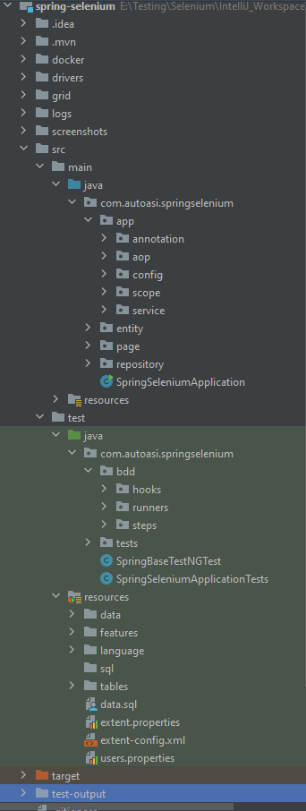
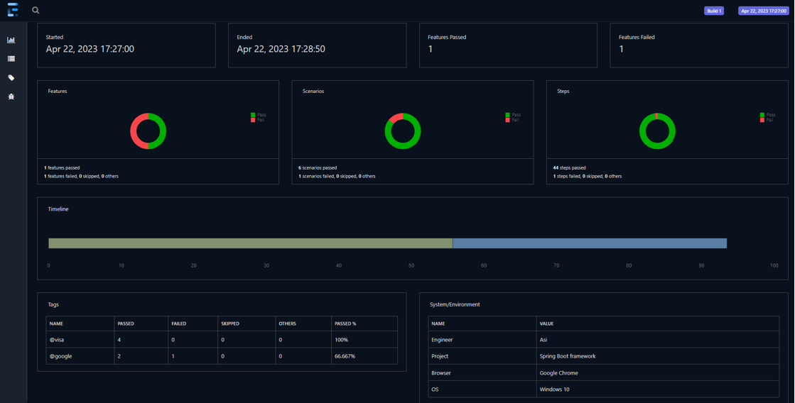
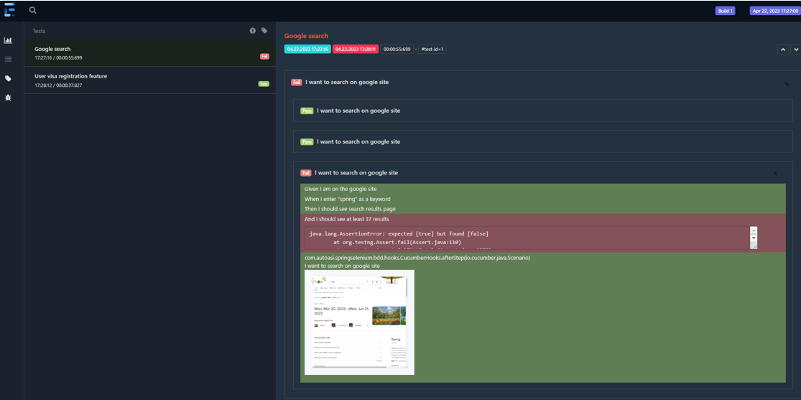
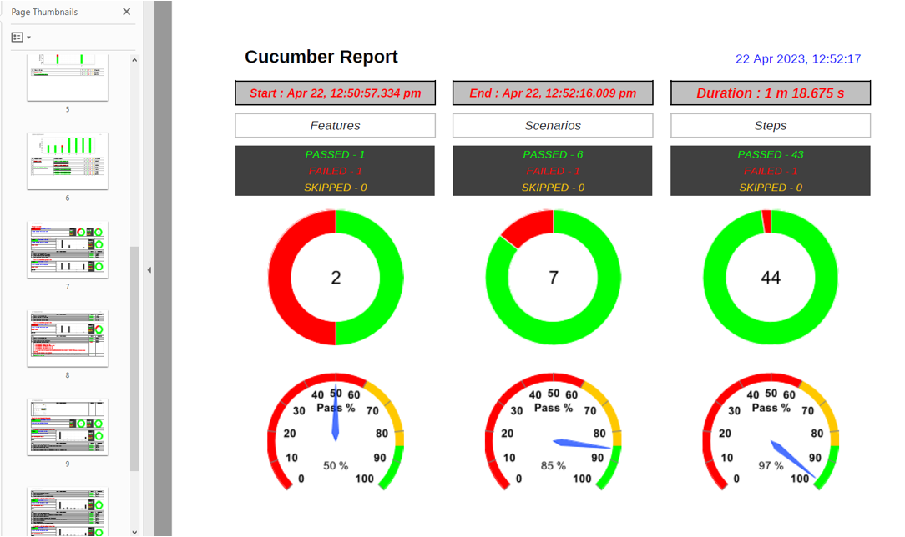
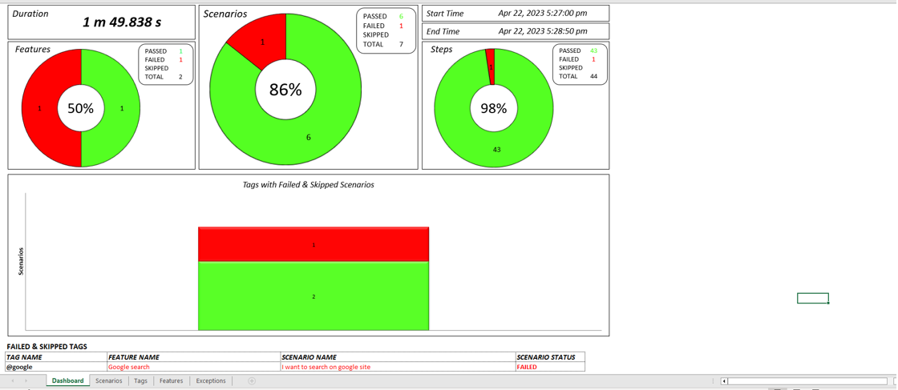

# Spring Boot Cucumber Framework

## Framework goals
- Scalable and extensible
- Reusable Rest Assured specifications
- Page Object Model
- Spring Profile - For multiple test environments
- Localization Testing for multiple languages
- Support for multiple browsers
- Aspect Oriented Programming (AOP)
- Custom Spring Scope for WebDriver
- Custom Annotations
- Spring Data JPA - Data Driven Testing
- Spring Logger
- Data driven testing by loading a CSV file in to a runtime DB
- Accessing files
- Taking screenshot on failure
- Automatic window/frame switching
- Executing cucumber feature files with automatic dependency injection
- Support parallel execution
- Data driven using TestNG Data Provider
- Maven command line execution
- Cucumber Report
- Extent Report

## Tools and Technologies
- Spring Boot
- Cucumber
- Gherkin
- Selenium
- Grid4
- TestNG
- JUnit
- JPA
- AOP
- Java
- Maven
- Git
- Extent Report

## Framework’s Structure

## Extent Report Examples
### HTML Extent Report

### PDF Extent Report

### Excel Extent Report
